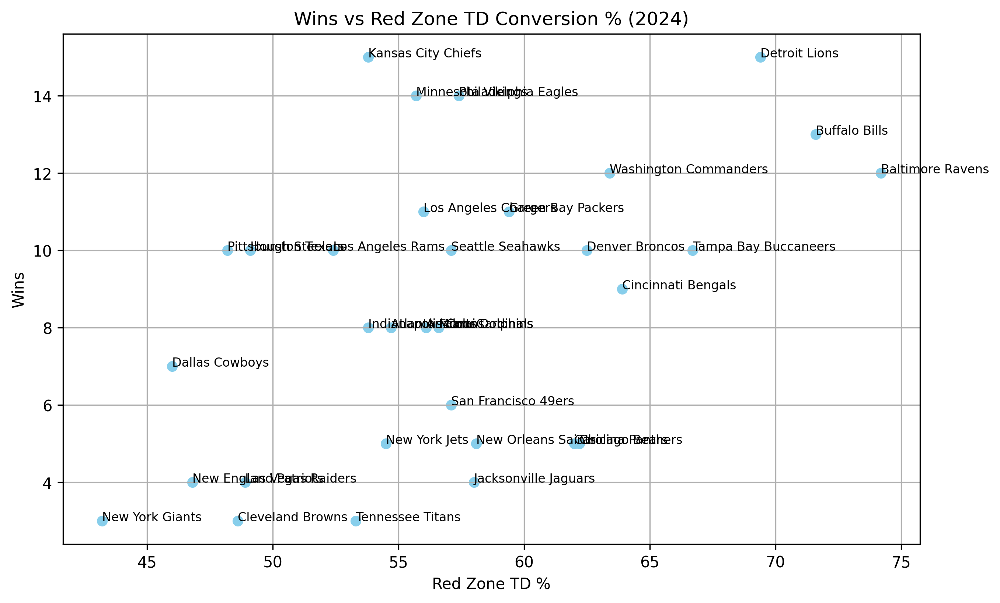
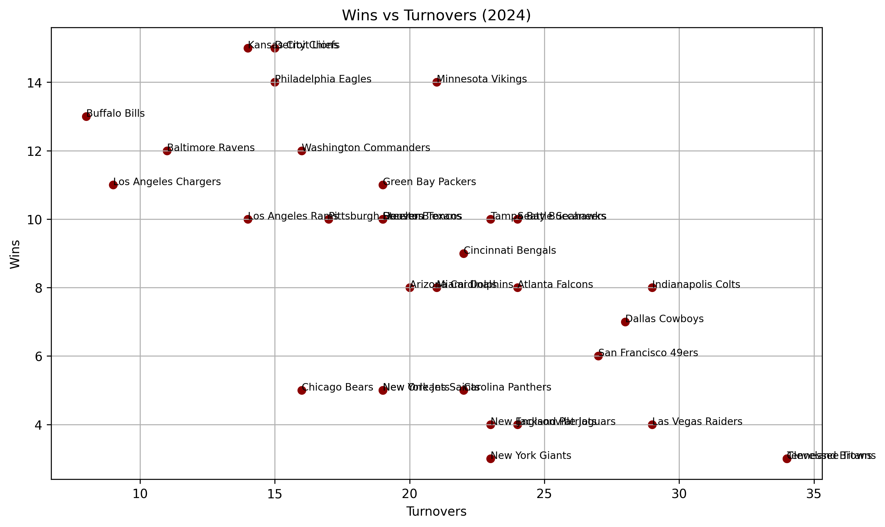

# 🏈 NFL 2024 Team Efficiency Analysis

This project analyzes the relationship between **team performance metrics** and **wins** during the 2024 NFL season.
Using a **custom-built dataset** from Pro Football Reference, I explored trends in **red zone efficiency, third down conversion, turnovers, and rushing/passing performance** to uncover the key factors that contribute to winning football games.

This type of exploratory data analysis mirrors the work sports organizations do to evaluate performance, identify strengths/weaknesses, and make data-driven decisions.

---

## 🔍 Project Goals

* Determine which metrics most strongly correlate with wins
* Communicate findings through clear, compelling **visualizations**
* Practice **EDA** and **sports analytics storytelling** using real-world NFL data

---

## 📊 Key Insights

* **Red Zone Efficiency Wins Games** – Teams that converted more red zone opportunities into touchdowns consistently ranked among the top in wins.
* **Third Down Conversion Matters** – Sustaining drives by converting on third down had a noticeable impact on win totals.
* **Turnover Discipline is Critical** – Teams with fewer giveaways (e.g., Bills, Chargers) had stronger win records than those with high turnover counts.
* **Total Yards Can Be Misleading** – Some high-yardage teams struggled to turn yardage into wins, showing that efficiency matters more than volume.

---

## 📈 Visual Highlights

| Wins vs Red Zone TD %                                    | Wins vs Third Down %                                   |
| -------------------------------------------------------- | ------------------------------------------------------ |
|  |  |

| Wins vs Turnovers                                  |
| -------------------------------------------------- |
|  |

---

## 🛠 Tools & Technologies

* **Python**: Pandas, Matplotlib, Seaborn
* **Jupyter Notebook** for EDA and visualization
* Custom CSV dataset scraped from **Pro Football Reference**

---

## 📌 Why This Matters

Sports organizations rely on analytics to **identify winning patterns** and **optimize performance strategies**. This project demonstrates:

* Data cleaning and preparation
* Finding meaningful trends in performance data
* Presenting results with **clear visuals** and actionable insights

---

## 📁 Repository Structure

* `NFL_2024_User_Data.csv`: Cleaned dataset of 2024 NFL team stats
* `nfl_analysis.ipynb`: Notebook containing full analysis and visualizations
* `/images`: Chart images used in this README
* `README.md`: Project summary and insights

---

## 🚀 Next Steps

* Build a **Streamlit dashboard** for interactive data exploration
* Expand analysis to include **playoff data** or **player-level performance metrics**

---

### 💻 How to Run

1. Clone the repository
2. Open `nfl_analysis.ipynb` in Jupyter Notebook
3. Install dependencies:

   ```bash
   pip install pandas matplotlib seaborn
   ```
